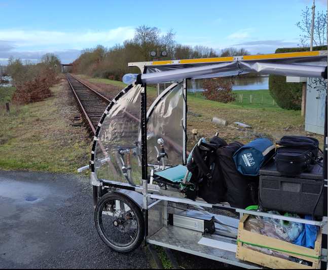

## Sur le chemin de l'autonomie...
Voilà plusieurs années que je cherche à être le plus autonome possible.

Mon objectif n'est pas de devenir autonome totalement, mais de cheminer pour comprendre comment fonctionnent les ressources et des outils que j'utilise.

En effet, j'ai l'impression de ne pas maitriser les choses, d'être dépendant de beaucoup de ressources, et de ne pas pouvoir agir dessus. 

Nous nous orientons doucement vers une société qui va devoir modifier complètement sa manière de produire, et de consommer. Faire avec la nature, utiliser et redonner à la nature...

Il y a quelques générations de cela, nos grand-parents vivaient connectés à la nature, aux animaux, lisaient dans les livres, écrivaient sur du papier avec des crayons, ils pouvaient réparer leur voiture et ne connaissaient que leur entourage géographiquement proche.

A présent, la modernité nous a apporter des choses intéressantes, des savoirs, des technologies, de la simplicité, de l'instantanéité, du "pratique", mais en nous dépossédant de notre responsabilité et de notre capacité à agir sur les choses.

Je ne suis pas là pour critiquer en bien ou en mal la société. Je souhaite juste, personnellement, me demander à chaque fois, si j'accepte d'être dépendant d'une technique ou d'une technologie, ou si je souhaite la comprendre, et pouvoir l'adapter à mes besoins.

C'est en cela que je suis intéressé par l'autonomie ("faire en son nom"). Comment habiter en ayant le moins d'impact possible, comment me nourrir sans faire ses courses dans un supermarché, comment créer nous-même notre monnaie pour mesurer nos échanges, comment récupérer l'énergie des éléments naturels pour nos besoins de base, et, depuis peu, comment me déplacer en consommant le moins d'énergie possible.

## Cartographier la transition

Voilà une dizaine d'années que je participe, autant que je peux (surtout bénévolement), à cartographier les alternatives sur le territoire. 

Au début, je croyais qu'on était des milliers à le faire (c'est peut-être vrai, mais je n'ai pas encore trouvé le réseau...), mais finalement, les passionné.e.s sont encore peu nombreux.ses ou dispercé.e.s sur le terrain.

J'ai donc commencé à faire ma part localement autour de chez moi. Cela a donné le projet Permalieux en Sarthe. En faisant cela, j'ai pu rencontré pleins de personnes aussi passionnées que moi, et qui se sentent aussi seules dans leur activité. J'ai donc rejoint l'association [Assemblée virtuelle](https://virtual-assembly.org), puis le projet [Transiscope](https://transiscope.org), qui souhaite afficher sur un portail, toutes les alternatives du territoire, mais **en laissant la main aux citoyens localement**. En effet, ce n'est pas une carte de plus, mais bien **LA carte** qui récupère directement les données dans une cinquantaine de sources (bases de données, fichiers...).

## Transiscope

Voilà bientôt 8 ans que le projet **Transiscope** a vu le jour, au début, nous en avons fait une bonne publicité, et il était très utilisé par la communauté militante (mais pas que...), puis, peu à peu, les énergies se sont taries, la fréquentation a diminué, et les implications locales aussi.

Pour moi, je projet Transiscope est un bel exemple de **coopération** et de **gouvernance partagée**. Nous pourrions faire un film à son sujet, pour expliquer tout ce qui a été mis en place pour qu'il fonctionne.

Depuis quelques années, nous avons fortifié l'équipe de coordination, en organisant des rencontres en réel, sur le terrain, que nous appelons des [transiscothons](https://transiscope.org/les-actus/). Cela nous permet de nous voir en vrai, de rencontrer des associations locales, de nous intéresser de près au territoire et de parler de notre projet.

## Les transiscothons
Lyon, Paris, Strasbourg, Quimper, Marseille !

Depuis 3 ans, les transiscothons sont une réussite. Nous fédérons de plus en plus de monde, et ça nous fait du bien !

Habitant en Sarthe, j'étais allé en voiture à celui de Quimper, mais ça faisait vraiment loin. Lorsqu'on m'a dit que le prochain était à Marseille, j'ai failli dire non, car je ne me voyais pas y aller en train (trop cher...), ni en voiture (trop long et surtout peu passionnant...).

## Le déclenchement
Mi février, suite à une discussion avec une amie proche, elle me dit qu'elle me verrait bien partir sur les chemins, pour vivre des expériences personnelles enrichissantes, rencontrer des lieux et des gens... 

Ca n'a fait qu'un tour dans mon cerveau, et à 4h du matin, le projet était presque bouclé... Je me lève, je regarde les distances, le temps restant, c'est jouable... Ca me motive, deux semaines après, j'étais parti.

